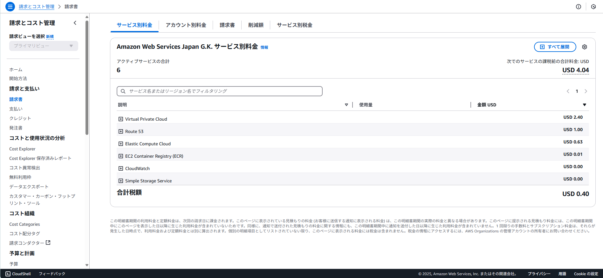
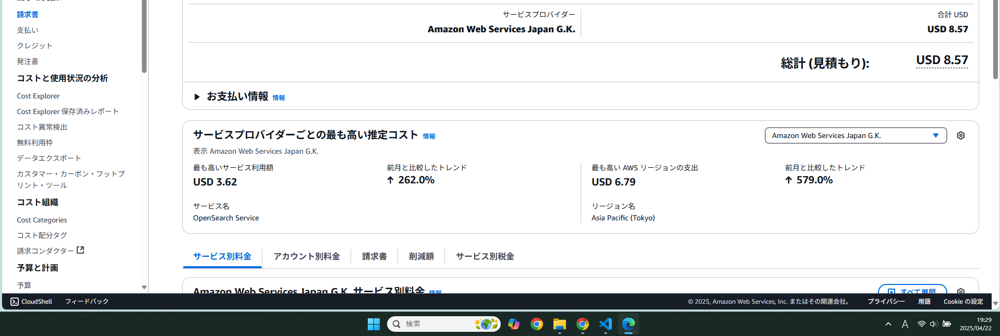

## コストまとめ
**まとめ — 月間入力 100 万日本語文字（≒100 万 token）を前提にした概算**

| 区分 | 単価 | 消費量 (月) | 小計 (USD) |
|---|---|---|---|
| **Titan Text Embeddings v2** （クエリをベクトル化） | $0.000 02 / 1 k token citeturn11search1turn11search2 | **1000 k token** | **$0.02** |
| **Amazon Nova Pro** Input | $0.000 8 / 1 k token citeturn10search0turn10search1 | 1000 k token | $0.80 |
| Amazon Nova Pro Output※ | $0.003 2 / 1 k token citeturn10search0turn10search1 | 1000 k token | $3.20 |
| **Bedrock 小計** | | | **$4.02** |
| **OpenSearch Serverless（Vector Engine）** Compute 4 OCU （2 ingest + 2 search, HA 最少構成） | $0.24 / OCU-h × 24 h × 30 d citeturn12search0turn12search4 | 4 OCU | **$691.20** |
| ストレージ例 5 GB | $0.024 / GB-mo citeturn12search0 | 5 GB | $0.12 |
| **OpenSearch 小計** | | | **$691.32** |
| **概算総額** | | | **≈ $ 695.34 / 月** |

※応答長を「入力と同程度」と仮定。長めに生成する場合は出力側が増え、Nova Pro 分が線形で伸びます。

---

## 1. 前提と換算ロジック

### 文字→token
* 日本語は BPE でほぼ 「1 文字 ≈ 1 token」になるため、100 万文字 ≒ 100 万 token と置きました。citeturn11search5  
* 1 k token = 1,000 token、1 M token = 1,000 k token。

### Bedrock 側
* **Titan Text Embeddings v2** はクエリごとにベクトル化が発生し、料金は *入力 token のみ* 課金（出力なし）。単価 $0.000 02/1 k token。citeturn11search1turn11search2
* **Amazon Nova Pro** は $0.000 8/1 k input と $0.003 2/1 k output。citeturn10search0turn10search1
* Knowledge Base 機能そのものには独立した従量課金はなく、実質 Embedding とベクタ DB コストで構成されます。citeturn14search1

### OpenSearch Serverless（Vector Engine）
* 最少でも **4 OCU**（AZ 冗長構成で Index 2 + Search 2）を常時稼働。citeturn12search4
* OCU 単価は **$0.24/OCU-hour**、24 h × 30 d = 720 h。→ 0.24 × 4 × 720 = $691.20。citeturn12search0
* ストレージは $0.024/GB-month。5 GB のベクタ格納なら約 $0.12。citeturn12search0

---

## 2. コスト感を左右する変数

| 影響要因 | 変動幅 | 補足 |
|---|---|---|
| **出力 token** | 0.5〜2 × 入力 | 長文回答を促すと Nova Pro の出力課金が増加 |
| **OCU スケール** | +1 OCU あたり +$0.24/時 | 高頻度クエリや大量ドキュメントで自動スケール |
| **冗長性オプション** | 非冗長（2 OCU）なら ≈ $345/mo | 検証環境など片 AZ で可 |
| **ベクタストレージ量** | 1 GB あたり +$0.024/mo | ドキュメント数・embedding dimで増減 |
| **Query Embedding** | (token 数) × $0.000 02/k | 検索回数が極端に多い場合のみ効いてくる |

---

## 3. 料金最適化のヒント

1. **開発環境は非冗長 2 OCU で開始し、トラフィックに応じて MaxOCU を制御** — 約 $345/月 に抑制可。citeturn11search3  
2. **簡易問い合わせは Nova Lite/Micro にルーティング**  
   *Bedrock Intelligent Prompt Routing* でクエリ難度に応じてモデルを自動選択するとコストを最大 30 % 削減。citeturn8view0  
3. **出力長を `maxTokens` で制限** — 特に Nova Pro は出力単価が入力の 4 倍。  
4. **ドキュメント前処理でチャンクを最小化** — token 削減 = Embedding コスト・検索レスポンス向上両方に効く。  
5. **クエリ／応答をキャッシュする** — 同一質問の再計算を回避。OpenSearch の `vector_cache` か Bedrock Prompt Caching を活用。citeturn8view0  

---

## 4. まとめ

* **Bedrock 推論だけなら月 $≈4** で済むが、**本命コストは OpenSearch Serverless の常時稼働 OCUs**（≈$700/mo）。  
* 検証・低負荷用途は **非冗長 2 OCU** でスタートし、負荷に合わせて増減させるのが現実的。  
* トラフィックが少なくても “24 h × OCU” は固定費になる点を忘れず、頻繁にスケールイン・スケールアウトをモニタリングするとムダを抑えられます。

> **最終的な月額目安**  
> *本番 HA:* **約 $695 / 月**  
> *検証 (2 OCU):* **約 $349 / 月** – ここに Bedrock $4/帯域 & S3 等の小コストを加味。  

必要に応じて AWS Pricing Calculator で実際のベクタ件数・OCU 上限・出力 token 規模を入れて再試算してください。citeturn13search3

## 2025/4/21

---

## 2025/4/22

