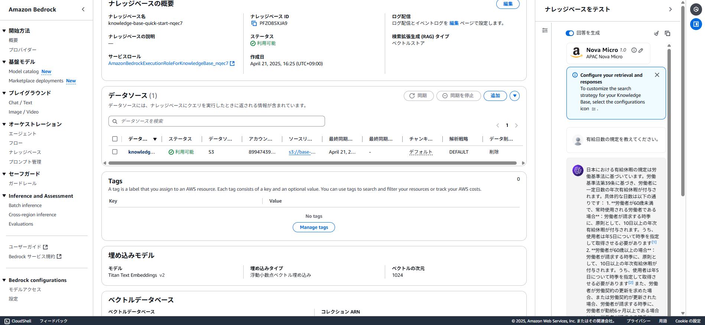

# knowledge

AWS Bedrock の **Knowledge base（ナレッジベース）** 機能は、  
外部のドキュメントやデータに基づいて、**大規模言語モデル（LLM）に賢く回答させる**ための仕組みです。  
いわゆる「**RAG（Retrieval Augmented Generation）**」を簡単に構築できます。

---

## 🧠 Bedrock Knowledge Base の主な機能

| 機能 | 内容 |
|------|------|
| 🔍 検索補助（RAG） | ユーザーの質問に対して、事前に登録したナレッジから情報を検索し、それを元に回答 |
| 📄 外部データ連携 | S3に保存したPDF・テキスト・HTML・CSV・JSONなどのデータを対象にできる |
| 🔗 ベクトルストア連携 | OpenSearch Serverless、Pinecone、Redisなどと連携して検索を高速化 |
| 🔐 アクセス制御 | IAMによってアクセス制限を設定可能 |
| 🧩 エンベディングの選択 | Amazon Titan Embeddings などの埋め込みモデルを選べる |
| 🚀 コンソール／API対応 | Bedrock StudioやBedrock API経由でRAGを呼び出せる |

---

## 🧰 作成できる Knowledge Base の種類

大きく分けて以下の2タイプを作成可能です：

### ① ベクトルストア連携型（主流）
- **構成**：
  - データ：S3 バケットにあるドキュメント
  - 埋め込み：Amazon Titan Embeddings など
  - ベクトルストア：OpenSearch Serverless、Pinecone、Redis Enterprise Cloud
- **用途**：
  - PDFマニュアル、FAQ、社内Wiki、商品仕様書などの検索・回答用
- **メリット**：
  - 柔軟で、検索精度が高い
  - カスタムプロンプトと組み合わせて業務アシスタントが作れる

### ② 構造化データソース型（今後の拡張対象）
- 現時点（2025年4月）では、主に **ベクトル検索型**が対象  
  → 将来的に、**SQLデータベースやSharePoint**などの構造化データも対象予定

---

## 📚 どんな Knowledge を作れる？

| 分類 | 具体例 |
|------|--------|
| 社内マニュアル | 操作手順、トラブルシューティングガイド、業務フローなど |
| FAQ集 | 顧客対応・技術的な質問と回答 |
| 製品ドキュメント | API仕様書、製品ガイド、ユーザーマニュアルなど |
| ナレッジ共有 | 社内のSlackログ、Wiki、Notionのエクスポートなど |
| 法務・契約 | 利用規約、契約書の条項検索・比較など |
| 学習資料 | 社内研修教材、eラーニング資料など |

---

## 🧪 こんな使い方もできる

- Bedrock Studio で Chat UI を作って「社内GPT」として公開
- LambdaやAPI Gatewayと組み合わせてSlackボット化
- マルチテナント対応させて顧客別にナレッジを分ける（要実装工夫）

---

---

---

---

---

---

---

---

---

