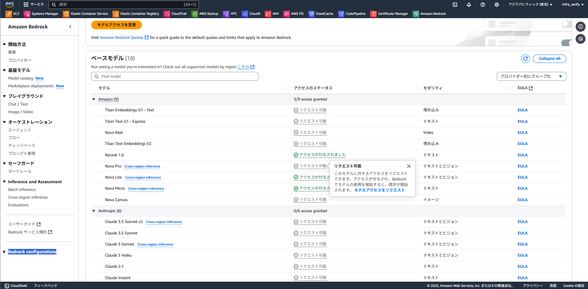
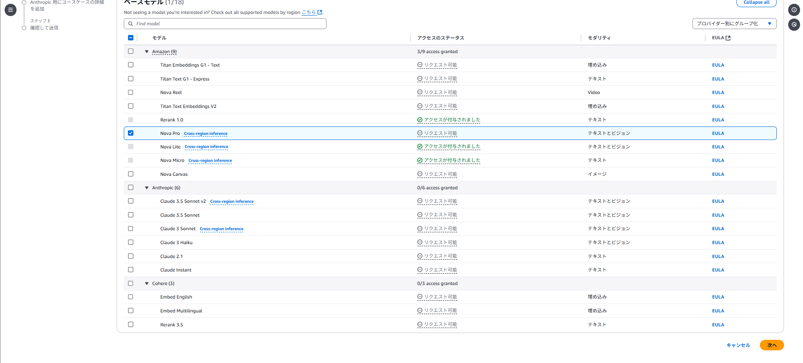
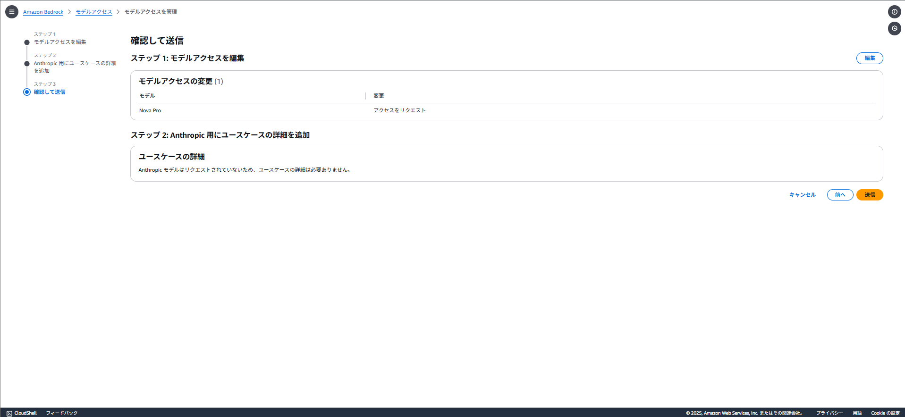
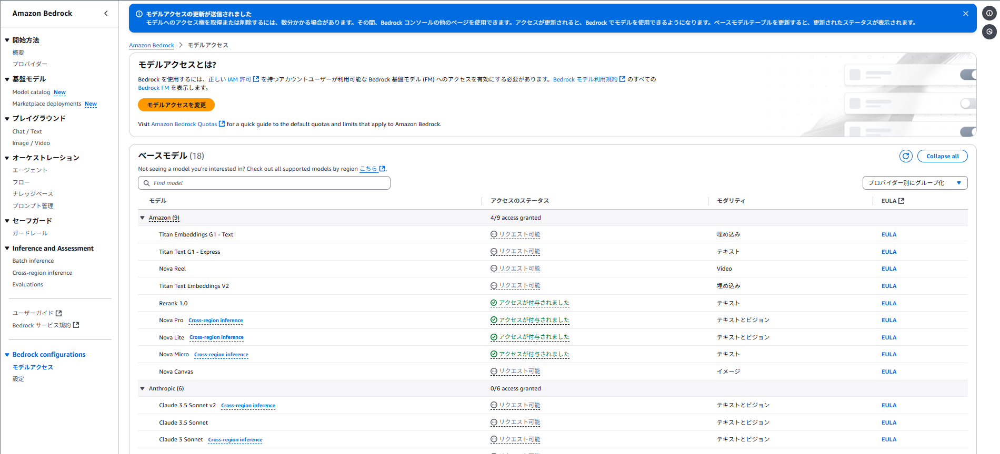

## Model_Request

AWS Bedrock の「Bedrock configurations（ベッドロック構成）」で**モデルアクセスを付与**する操作は、主に以下の目的で行われています：

---

### ✅ **何をしているか：**

Bedrock configurations において **モデルアクセスを有効化（付与）**することで、  
**選択した Foundation Model（基盤モデル）** へのアクセス権を  
**アカウント単位で有効にする**設定をしています。

---

### 🔍 **具体的には：**

- Bedrock 上で使えるモデル（Anthropic Claude、Amazon Titan、Meta Llama、Mistral、Cohere など）は、  
  **最初から自動的にすべて利用可能ではない**ため、  
  利用したいモデルを **明示的に選択し、アクセスを許可**する必要があります。

- 「Bedrock configuration」画面で：
  - 利用するモデルを選ぶ
  - モデルプロバイダーの利用条件に同意する（例：ClaudeならAnthropicの条件）
  - [✔ モデルアクセスを付与] をオンにする

---

### 📦 **この設定の影響：**

- 選択したモデルに対して：
  - Bedrock コンソールや API（InvokeModel APIなど）経由で呼び出し可能になる
  - Bedrock Studio などのツールでも利用可能になる
- 選択しなかったモデルはアクセス不可（APIリクエストも拒否される）

---

### 💡補足：

- モデルプロバイダーによっては、利用にあたり追加の利用規約への同意が必要です。
- 料金は**モデルごとに異なり**、アクセスを有効にしただけでは課金は発生しません。  
  → 実際に **APIを呼び出したときに課金されます。**

---

-----

-----

-----

